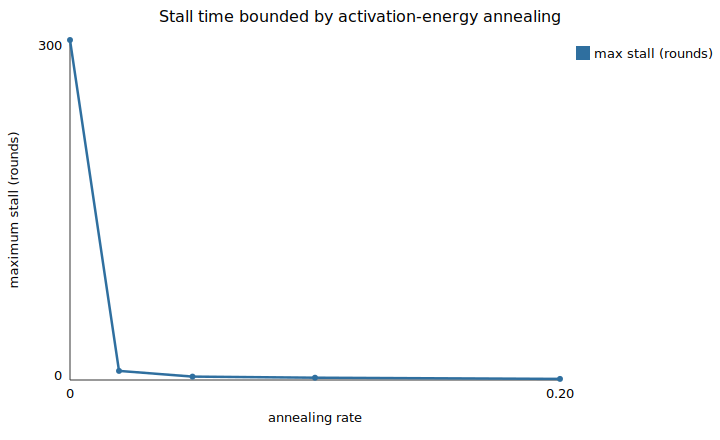
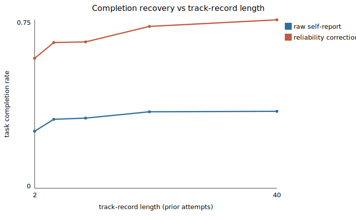
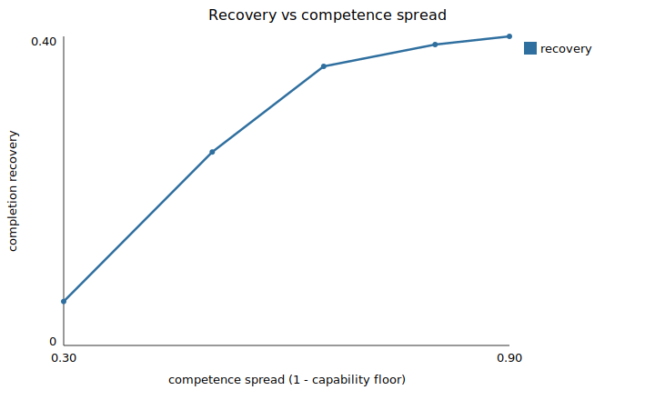
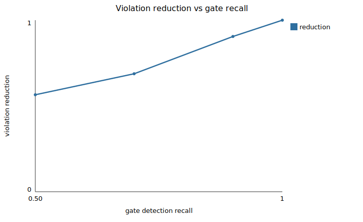
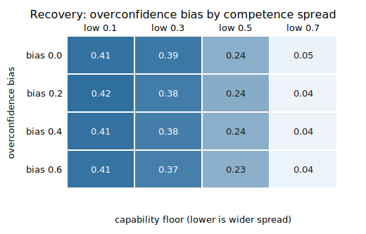
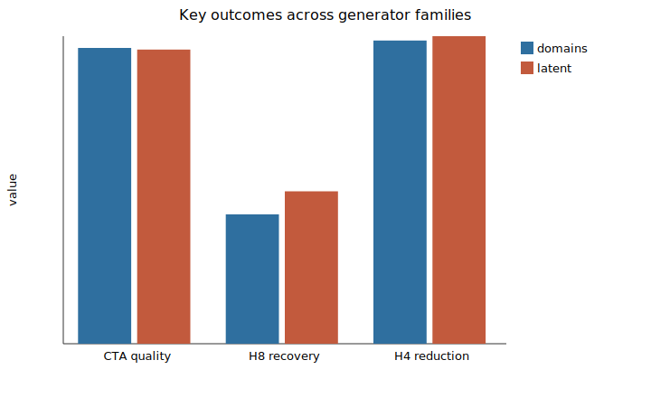
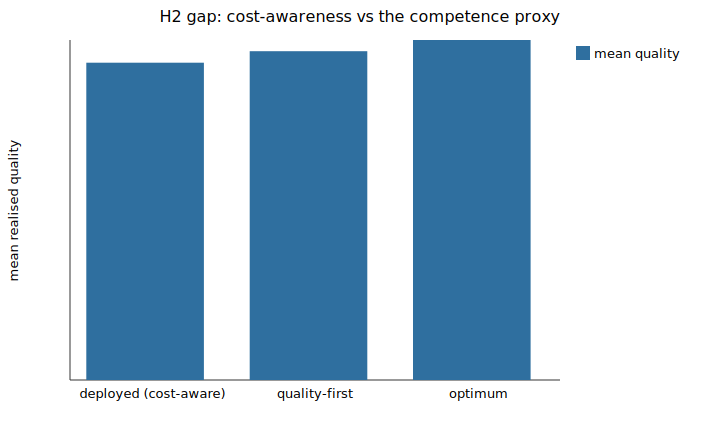
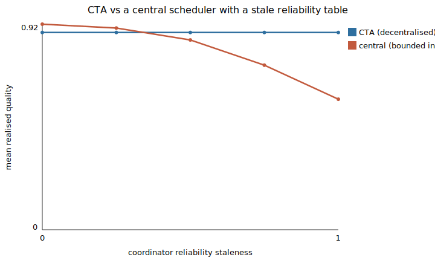
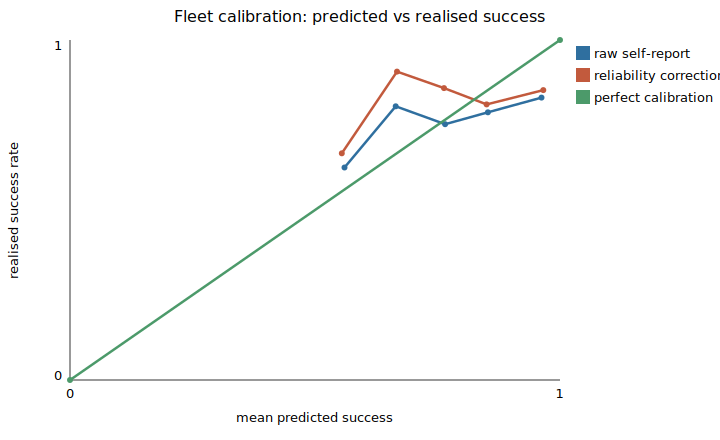
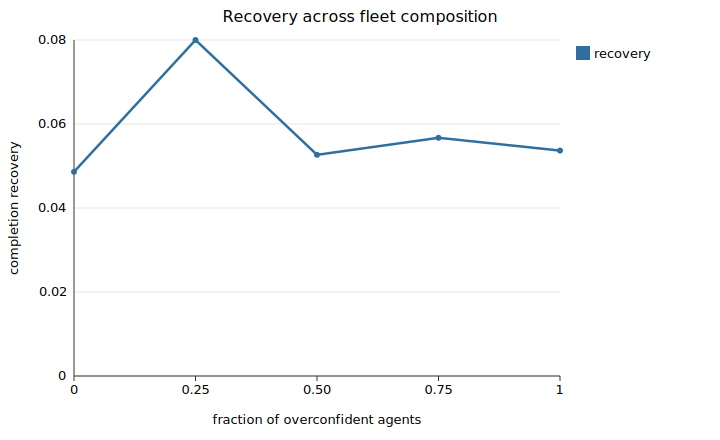

# Results (autorun)

These results are generated by `cta autorun`. They are reproducible from the
committed configuration and seeds. Verdicts are supported, not supported, or
pending.

## Hypotheses

| Hypothesis | Verdict | Claim |
| --- | --- | --- |
| H1 | SUPPORTED | peak per-node load grows more slowly for CTA than central |
| H2 | NOT SUPPORTED | CTA quality is not worse than pull-based and within margin of the optimum |
| H3 | SUPPORTED | the engine labels infeasible and stalled tasks correctly |
| H4 | SUPPORTED | the integrity gate substantially reduces out-of-scope writes |
| H5 | SUPPORTED | annealing bounds the stall time of feasible tasks |
| H6 | NOT SUPPORTED | CTA advantage over the optimum increases with heterogeneity |
| H7 | SUPPORTED | self-reports over-predict realised success because they omit competence |
| H8 | SUPPORTED | the track-record correction recovers completion under miscalibration |
| H9 | SUPPORTED | CTA matches or beats central coordination once its table is stale |

## Figures

## Peak per-node load scaling

| N | cta | pull_based | central_greedy | central_optimal | central_best | central_bounded |
| --- | --- | --- | --- | --- | --- | --- |
| 50 | 32.0 | 45.5 | 2000.0 | 2000.0 | 2000.0 | 2000.0 |
| 100 | 32.0 | 53.1 | 8000.0 | 8000.0 | 8000.0 | 8000.0 |
| 200 | 32.0 | 56.2 | 32000.0 | 32000.0 | 32000.0 | 32000.0 |
| 500 | 32.0 | 59.8 | 200000.0 | 200000.0 | 200000.0 | 200000.0 |
| 1000 | 32.0 | 61.0 | 800000.0 | 800000.0 | 800000.0 | 800000.0 |
| 2000 | 32.0 | 62.8 | 3200000.0 | 3200000.0 | 3200000.0 | 3200000.0 |
