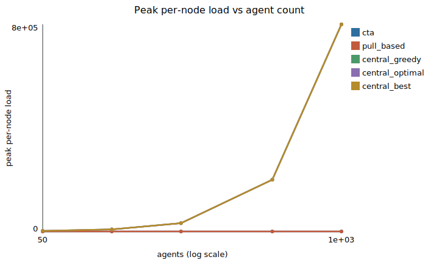
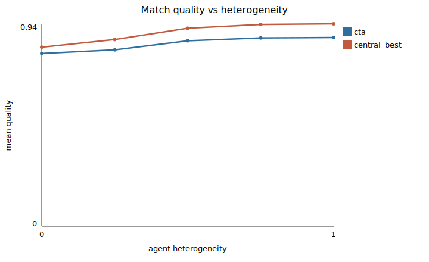
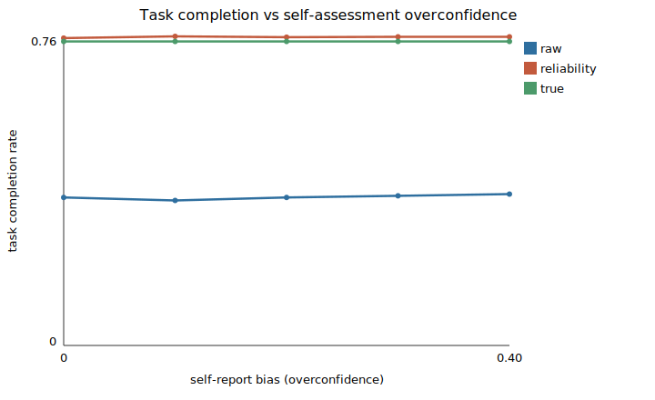

# Results (autorun)

These results are generated by `cta autorun`. They are reproducible from the
committed configuration and seeds. Verdicts are supported, not supported, or
pending.

## Hypotheses

| Hypothesis | Verdict | Claim |
| --- | --- | --- |
| H1 | SUPPORTED | peak per-node load grows more slowly for CTA than central |
| H2 | SUPPORTED | CTA quality is not worse than pull-based and within margin of the optimum |
| H3 | SUPPORTED | the engine labels infeasible and stalled tasks correctly |
| H4 | SUPPORTED | the integrity gate prevents out-of-scope writes under adversarial agents |
| H5 | SUPPORTED | allocation is stable and the barrier behaves monotonically |
| H6 | NOT SUPPORTED | CTA advantage over the optimum increases with heterogeneity |
| H7 | SUPPORTED | self-reports over-predict realised success (overconfidence gap) |
| H8 | SUPPORTED | the track-record correction recovers completion under miscalibration |

## Figures

## Peak per-node load scaling

| N | cta | pull_based | central_greedy | central_optimal |
| --- | --- | --- | --- | --- |
| 40 | 32.0 | 40.0 | 1280.0 | 1280.0 |
| 80 | 32.0 | 49.6 | 5120.0 | 5120.0 |
| 160 | 32.0 | 54.6 | 20480.0 | 20480.0 |
| 320 | 32.0 | 56.6 | 81920.0 | 81920.0 |
