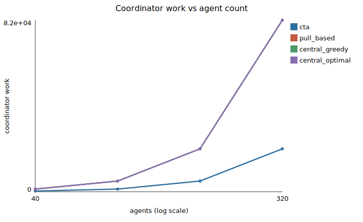

# Results (autorun)

These results are generated by `cta autorun`. They are reproducible from the
committed configuration and seeds. Verdicts are supported, not supported, or
pending.

## Hypotheses

| Hypothesis | Verdict | Claim |
| --- | --- | --- |
| H1 | SUPPORTED | coordinator work grows more slowly for CTA than central |
| H2 | SUPPORTED | CTA quality is not worse than pull-based and within margin of the optimum |
| H3 | PENDING (needs labelled generator ground truth) | infeasible and stall labelling |
| H4 | PENDING (needs the gate ablation run) | gate preserves integrity under unreliability |
| H5 | PENDING (needs the Ea by T sweep) | stability across Ea and T |
| H6 | NOT SUPPORTED | CTA advantage over the optimum increases with heterogeneity |

## Figures

## Coordinator-work scaling

| N | cta | pull_based | central_greedy | central_optimal |
| --- | --- | --- | --- | --- |
| 40 | 326.0 | 1280.0 | 1280.0 | 1280.0 |
| 80 | 1269.4 | 5120.0 | 5120.0 | 5120.0 |
| 160 | 5115.6 | 20480.0 | 20480.0 | 20480.0 |
| 320 | 20485.2 | 81920.0 | 81920.0 | 81920.0 |
